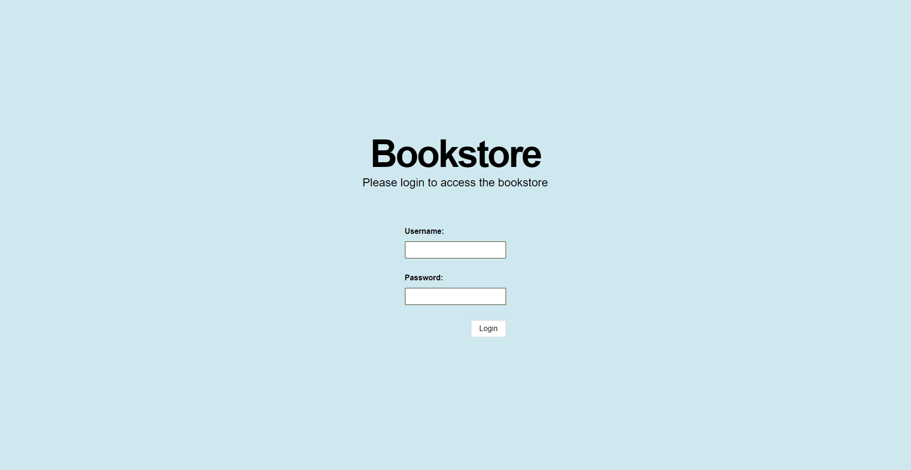
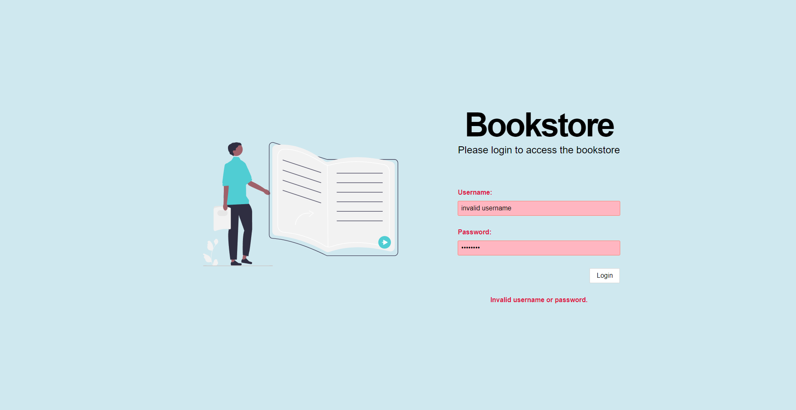
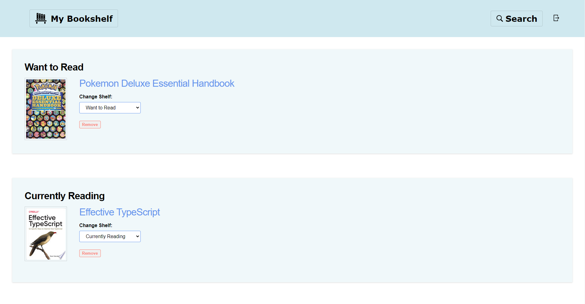
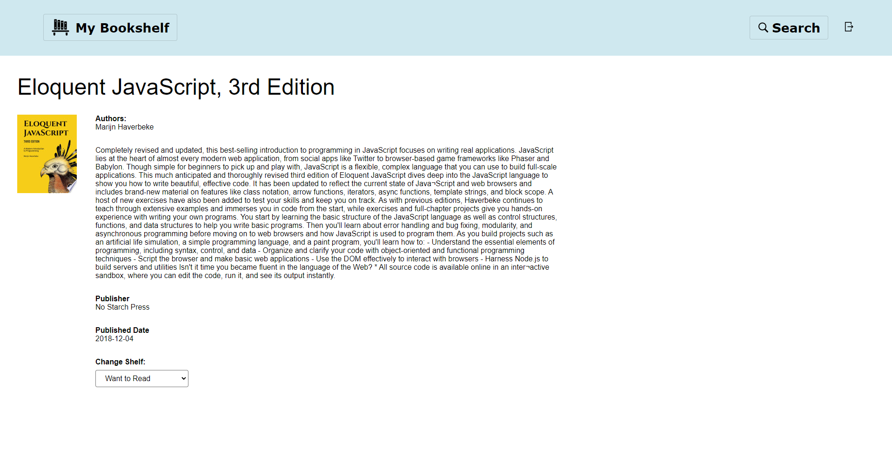

# Book-Store

A frontend bookstore project with Vite using Typescript, featuring Routing, Auth and AJAX processing through Axios.

## Demo Preview









## Getting Started

A live demo of the project can be found [here](https://chrisdruke-bookstore.onrender.com).

If you'd like to host the project yourself, clone the repo and within the root of the project run `npm run start` command to host the localized API server (probably at `localhost:3000`). Then navigate into `/client` and run `npm run dev` to host the bookstore frontend locally.

To login to the application, you can use either of the following credentials:

```
username: harry
password: potter
```

```
username: hermione
password: granger
```

## Acknowledgements

- [Matina](https://www.linkedin.com/in/matina-patsos-63aa2626/) & [Jamal](https://www.linkedin.com/in/jamal-taylor/) - for their continued guidance and advice with the project, and web development as a whole! :smile:

## Contributions

- [Icons8](https://icons8.com/) - for the icon CDN used to deliver the project icon files
- [Undraw](https://undraw.co/illustrations) - for the login SVG

### To-Do

- [x] Implement routing between different pages
- [x] Implement search AJAX request logic & display functionality
- [x] Implement individual book detail display
- [x] Implement basic login form validation
- [x] Implement login authentication
- [x] Implement bookshelf AJAX request & display functionality
- [x] Implement logic for movement of books between shelves
- [x] Implement logic allowing user to remove book from bookshelf
- [x] Implement logic allowing user to add book to a shelf
